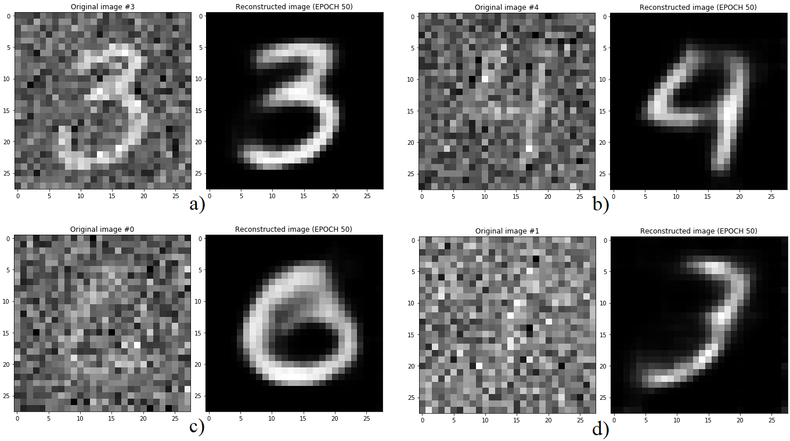
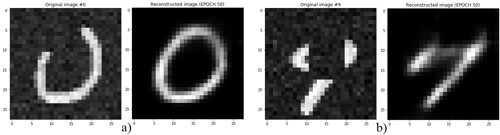
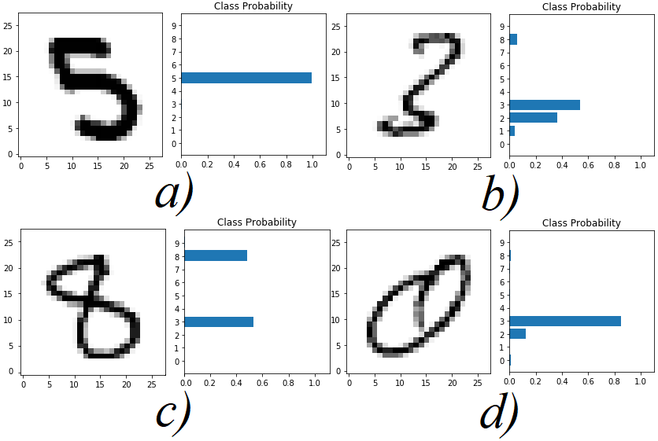
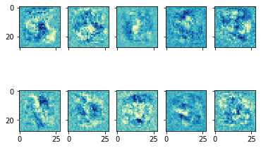
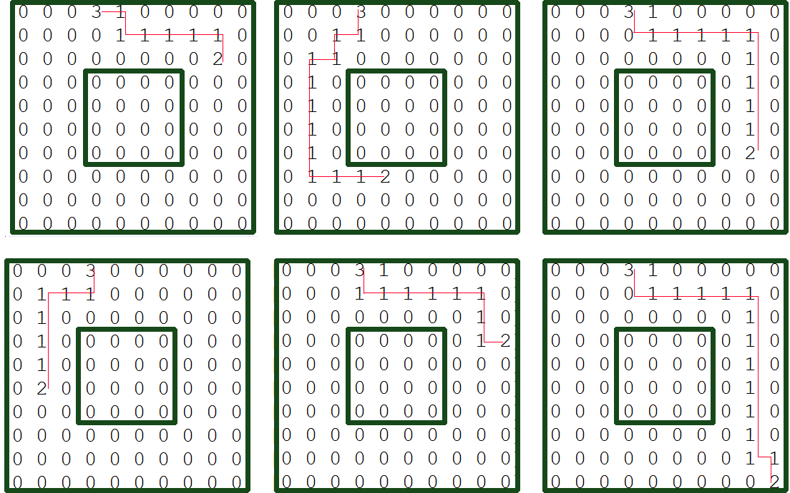

# Deep learning & neural network - DLNN
A collection of four DLNN application: 
- Autoencoder reconstruction
- MNIST recongnition and analysis
- Reinforcement learning
- Text generator

The scripts are written in python 3.7.x, in order to run them you need: 
- [pyTorch](https://pytorch.org) 
- [scipy](https://www.scipy.org/)
- [scikit-learn](https://scikit-learn.org/stable/)
- [numpy](https://numpy.org/)

>**The code has been made and tested with a nvidia GPU.** Even if some pieces of code should run (slower) even with your CPU, I >can't be sure the entire script would run. 

Inside every model's folder there is PDF with the full description of what I do and why from a theoretical point of view. 

Here a brief description for every project:

# Autoencoder reconstruction
The aim of this laboratory is to train an autoencoder on the MNIST dataset
and test its reconstruction capability. In order to do so, the following tasks have been
implemented:
- add noises on the dataset: Gaussian noise and obstruction;
- tuned the network parameters with a grid-search and a k-fold.

>
>*For every couple of images, on the left the image the network is fed with and on the
>right the reconstructed output. The used Gaussian noises (zero mean) have different standard
>deviations (sd): a) a three with 0.3 sd, correctly reconstructed; b) a four with 0.58 sd, correctly
>reconstructed; c) a zero with 0.78 sd, correctly reconstructed; d) a one with 0.99 sd, wrongly
>reconstructed.*

>
>*Example of two images with Gaussian noise plus occlusion and the output of the
>network. a) An image of a zero on the left, it is correctly reconstructed on the righ*

# MNIST recognition and analysis
For this second homework the exercise is related to the classification of
handwritten digits of the MNIST dataset. The required tasks are the following:
- extract the data and labels from the given MATLAB file;
- propose a neural network (NN) for the classification of 10 digits;
- implement a cross-validation scheme and search the best hyper-parameters using
a search procedure;
- calculate the mean classification accuracy;
- the output of the network should be of size ten plus a single integer number
representing the predicted class.

>
>*a) represent the majority of the results: the image is correctly classified without
>uncertainty; b) the model presents some ambiguity, but it’s still able to correctly recognise the
>digit; c) the model fails to recognise the correct digit, but still recognise it as possible with
>relatively high probability; d) the model completely fail to recognise the digit.*

>
>* Ten of the receptive fields at the first hidden layer.*

# Reinforcement learning
The aim of this final homework is to train an Agent to move in a 10x10
checkerboard in order to reach a certain point as a goal. To do so I implement the
following tasks:
-add an obstacle in the center of the map, the Agent needs to avoid and circum-
navigate it;
- after a simple grid search to find the best parameters, training and testing the
model with Q-learning, SARSA with ε-greedy and SARSA with softmax to com-
pare the results.

>
>*Some of the final tests with the model trained using Q-learning on the top, SARSA with ε-greedy in
>the middle and SARSA with softmax in the bottom. The matrices have been generated from the results, the green
>and red lines have been added using a graphical software. "3" is the goal, "2" the start and "1" the steps.*

# Text generator
For this third laboratory, the assignment is to train a neural network to
produce a sequence of n characters in order to generate a text as if it would have been
written by an author. To do so, the following tasks have been implemented:
- after selecting the dataset, reduced it’s alphabet by changing and eliminating
some characters;
- tuned the neural network (NN) parameters with a grid search and k-fold;
- with a softmax and a temperature tuned the final generated text in order for it to
"make sense".
Final test produced by the network, input seed "blood of my enemies": 
>blood of my enemies, the kindnesse the death of all the world of care on my heart, that will i makes be connedprans, >great vs, and buckingham be brought to salsbury: richmond in ongre to the death with all the morning. in command liue, to >greet the tender princes knees would haue it sode let to his  thrie dead: the king mine vnckle is too blame for her lords >at pomfret, my lord of buckingham, that appe outharies both vnkles that the moueare me forme, and should be so dulling to >brother of thy faire and falthing dispaire and warre mind heart, that came 

In the same folder, there are also the text generators for the following masterpieces: 
- The Importance of Being Earnest by Wilde
- La Divina Commedia by Dante
- Le baruffe chiazzotte by Goldoni
